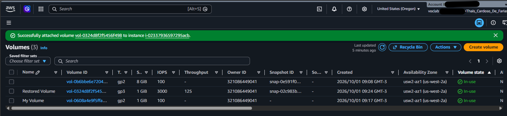
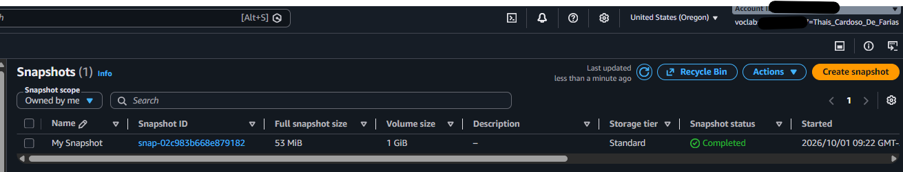
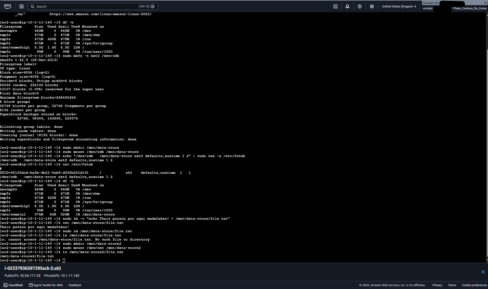

# AWS Hands-on: Gerenciamento, Backup e Recuperação de Dados com Amazon EBS

Este repositório contém a documentação prática do laboratório focado na administração de volumes **Amazon EBS (Elastic Block Store)**, criação de snapshots para backup e restauração de dados em instâncias **Amazon EC2**.

---

## 🎯 Objetivos do Laboratório
* Criar e anexar um volume EBS adicional a uma instância Linux EC2.
* Formatar o volume com o sistema de arquivos `ext3` e configurá-lo para montagem automática via `/etc/fstab`.
* Simular criação de dados e realizar o backup através de **Snapshots do EBS**.
* Simular a perda acidental de arquivos no ambiente.
* Restaurar um Snapshot em um novo volume EBS e recuperar com sucesso os dados perdidos.

---

## 🛠️ Tecnologias e Conceitos Utilizados
* **AWS Services:** Amazon EC2, Amazon EBS (Volumes & Snapshots), EC2 Instance Connect.
* **Linux Administration:** `mkfs`, `mount`, `/etc/fstab`, manipulação de diretórios e arquivos de bloco.
* **Estratégias de DR (Disaster Recovery):** Backup consistente em blocos e restore rápido.

---

## 🚀 Passo a Passo e Validação

### 1. Visão Geral dos Volumes EBS
Criação e anexo do volume principal e, posteriormente, do volume restaurado a partir do snapshot na mesma *Availability Zone* da instância.

---

### 2. Backup via Snapshot
Criação do snapshot `My Snapshot` para garantir a persistência dos dados antes do teste de desastre.

---

### 3. Execução no Terminal (Configuração, Teste de Incidente e Recuperação)
No terminal da instância EC2 foram realizadas as seguintes etapas:
1. Formatação (`mkfs -t ext3 /dev/sdb`) e montagem em `/mnt/data-store`.
2. Adição da regra de montagem automática no `/etc/fstab`.
3. Criação do arquivo de dados (`file.txt`).
4. Simulação de falha humana com a exclusão do arquivo (`sudo rm`).
5. Montagem do novo volume restaurado do Snapshot (`/dev/sdc`) em `/mnt/data-store2` e validação da recuperação do arquivo.

---

## 🧠 Aprendizados Chave
* **Ciclo de vida do EBS:** Entendimento sobre a independência entre a vida útil da instância EC2 e dos volumes EBS anexados.
* **Persistência de montagem:** Importância de configurar corretamente o `/etc/fstab` para garantir disponibilidade do volume em reboots.
* **Resiliência e DR:** Snapshots do EBS armazenam apenas os blocos alterados de forma incremental no S3, garantindo alta eficiência e recuperação ágil de dados em cenários de falha humana ou corrupção de sistema.
